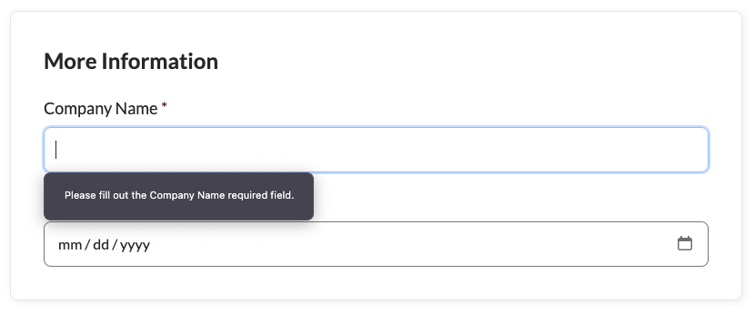
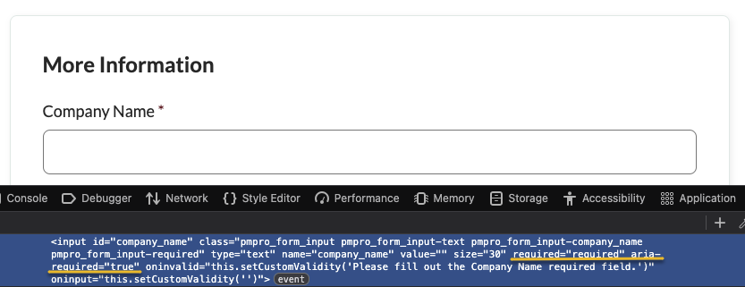
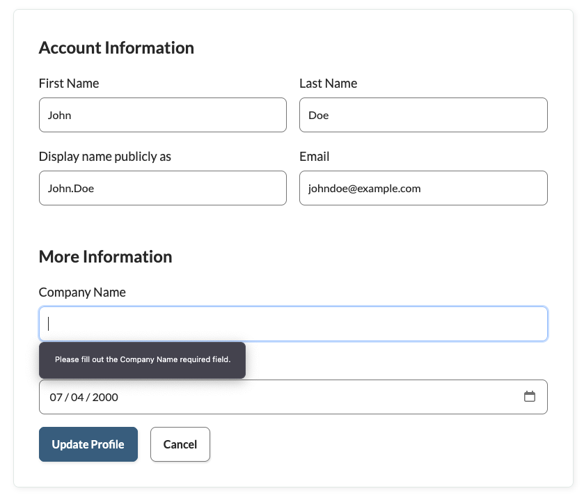

# HTML Form Validator for PMPro

Add native HTML5 validation and consistent, localized messages to Paid Memberships Pro (PMPro) custom user fields.

> Important: This plugin targets PMPro Custom User Fields only. It does not alter or validate PMPro’s default checkout fields like username, email, password, etc.

## Features

- Adds HTML5 validation attributes to required PMPro custom user fields on checkout:
  - `required` and `aria-required="true"`
  - Custom browser message via `oninvalid` and cleared on `oninput`
- Validates required custom user fields on the PMPro Member Profile Edit screen and returns a plain-text error message if empty.
- Provides filters to customize the validation message globally, per field, and per context.
- Fully translatable (text domain: `msl-form-validator`).

## Requirements

- WordPress 6.0+
- PHP 7.4+
- [Paid Memberships Pro](https://www.paidmembershipspro.com/) (required)

## Installation

1. Upload the plugin to `wp-content/plugins/msl-form-validator/` or install via the Plugins screen.
2. Activate "HTML Form Validator for PMPro" through the WordPress Plugins screen.
3. Ensure your PMPro custom user fields are marked as `required`.

## Usage

- Mark your PMPro custom user fields as required using the PMPro field API. This plugin will:
  - Add native HTML5 validation on the checkout form.
  - Validate required custom fields on the Member Profile Edit page and surface error messages.
- Default messages are provided, but you can customize them via the filters below.

## Filters

### 1) `msl_pmpro_required_field_message`
Filter the browser validation message shown for a required PMPro custom field (e.g., on checkout). Also used as the base default for the profile edit message.

Signature:

```php
apply_filters(
    'msl_pmpro_required_field_message',
    string $message_template,
    ?string $field_name,
    PMPro_Field $field,
    string $where
);
```

- `$message_template` Default template with a single "%s" placeholder for the human-readable label.
- `$field_name` The field key (may be null if not available).
- `$field` The `PMPro_Field` object.
- `$where` Context, e.g., `checkout`, `profile-edit`.

Example:

```php
add_filter( 'msl_pmpro_required_field_message', function( $message, $field_name, $field, $where ) {
    /* translators: %s: field label */
    return __( 'Kindly complete the required %s field.', 'msl-form-validator' );
}, 10, 4 );
```

### 2) `msl_pmpro_profile_edit_error_message`
Filter the error message template for required custom user fields on the Member Profile Edit screen. Receives the base default from `msl_pmpro_required_field_message`, allowing you to tailor messages specifically for profile edit.

Signature:

```php
apply_filters(
    'msl_pmpro_profile_edit_error_message',
    string $template,
    string $field_name,
    array $field,     // [ label, levels ]
    ?WP_User $user
);
```

- `$template` Message template with a single "%s" placeholder for the human-readable label.
- `$field_name` The field key/name being validated.
- `$field` An array with two items: `[ label, levels ]`.
- `$user` The `WP_User` being updated (if available).

Example:

```php
add_filter( 'msl_pmpro_profile_edit_error_message', function( $template, $field_name, $field, $user ) {
    /* translators: %s: field label */
    return __( 'You forgot to fill in the required %s field.', 'msl-form-validator' );
}, 10, 4 );
```

## Screenshots

> WordPress.org uses files in `.wordpress-org/` named `screenshot-#.png`. We mirror those here for GitHub.

1. Checkout browser validation bubble on a required custom user field  
   
2. Required PMPro custom user field with native HTML5 attributes  
   
3. Member Profile Edit shows a clear error when a required field is missing  
   

## Internationalization (i18n)

- Text domain: `msl-form-validator`
- Languages directory: `languages/`
- The plugin loads translations on `plugins_loaded` using `load_plugin_textdomain()`.
- A POT file is provided: `languages/msl-form-validator.pot`

To add translations:

1. Create a PO from the POT for your locale (e.g., `msl-form-validator-af_ZA.po`).
2. Compile to MO (`msl-form-validator-af_ZA.mo`).
3. Place both in the `languages/` directory.

## Contributing

- We use WordPress Coding Standards via PHPCS (`phpcs.xml.dist`).
- Dev setup and commands:

```bash
composer install
vendor/bin/phpcs -q
vendor/bin/phpcbf -q
```

- See `CONTRIBUTING.md` for release conventions:
  - GitHub releases: tag `vX.Y.Z`
  - WordPress.org deploys: tag `wporg-X.Y.Z`

## Packaging & Releases

- Clean zips are built using `git archive` with `.gitattributes` export-ignore rules.
- Local build: `scripts/package.sh` (output in `dist/`).
- CI attaches the clean zip to GitHub Releases automatically (`.github/workflows/package-release.yml`).

## License

GPL v2 or later. See `license.txt`.
